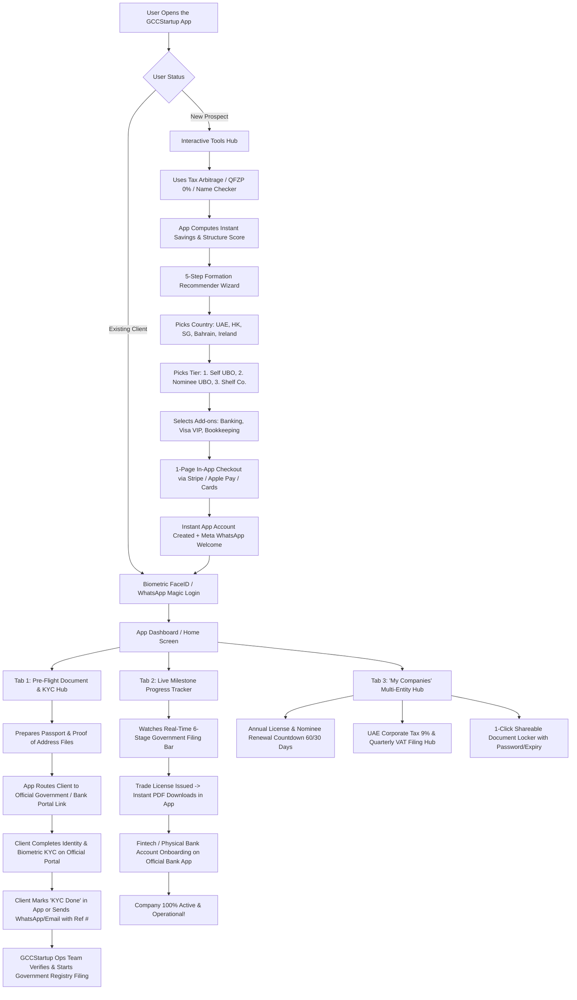

# GCCStartup.com — Complete Non-Technical Application Blueprint & User Flow Guide
## A Plain-English, Diagrammatic Explanation of the Dedicated Mobile & Web App

---

# 📱 Executive Summary: This Is a Dedicated Software Application

> [!IMPORTANT]
> **GCCStartup is an Application, NOT a Marketing Website.**  
> The marketing website (`gccstartup.com`) is just the front door. What we are designing and building here is a **dedicated cross-platform Application (iOS, Android, and Responsive Web App)**. 
> 
> Think of it like **Revolut / Befiler / Stripe Dashboard**: an interactive software tool with user accounts, bottom navigation tabs, official portal guidance, biometric FaceID login, push alerts, real-time filing progress bars, and secure document lockers.

> [!NOTE]
> **Official Portal KYC & Notification Handshake**: 
> 1. GCCStartup does NOT perform internal KYC verification or store sensitive government biometric IDs on our servers.
> 2. The client completes official identity/biometric verification directly on certified government registry and banking portals.
> 3. Once completed on the official portal, the client simply marks it in the app (or sends a quick WhatsApp / Email message) with their official Application / Reference Number.
> 4. GCCStartup's operations team receives the notification, cross-references with the government registry, and immediately proceeds with company incorporation.

---

# 🗺️ Master App Architecture & Screen Hierarchy

```
┌───────────────────────────────────────────────────────────────────────────────────────────────────┐
│                                 THE GCCSTARTUP APPLICATION SHELL                                  │
├───────────────────────────────────────────────────────────────────────────────────────────────────┤
│ • Mobile UX: Bottom Tab Bar [ 🏠 Home | 🛠️ Tools | 📁 Vault | 🏢 My Companies | 👤 Profile ]      │
│ • Desktop UX: Sleek Glassmorphism App Sidebar + Central Application View                          │
│ • Device Integrations: Official Portal Routing, Biometric FaceID/TouchID, In-App Notifications     │
└───────────────────────────────────────────────────────────────────────────────────────────────────┘
                                              │
         ┌────────────────────────────────────┼────────────────────────────────────┐
         │                                    │                                    │
         ▼                                    ▼                                    ▼
┌──────────────────────────────┐ ┌──────────────────────────────┐ ┌──────────────────────────────┐
│ 1. THE INTAKE APP ENGINE     │ │ 2. THE CLIENT APP COCKPIT    │ │ 3. THE ADMIN OPS APP         │
│ (Guest / Prospect Experience)│ │ (Authenticated Client Space) │ │ (Internal Team Command)      │
├──────────────────────────────┤ ├──────────────────────────────┤ ├──────────────────────────────┤
│ • 10 Interactive Micro-Tools │ │ • Multi-Entity "My Companies"│ │ • 10-Stage Kanban CRM App    │
│ • 5-Step Formation Recommender│ • Pre-Flight Doc Checklist   │ │ • Official Filing Coordinator│
│ • 3-Tier Dynamic Pricing     │ │ • Official KYC Portal Links  │ │ • Customer 360 Timeline      │
│ • 1-Page In-App Stripe Pay   │ │ • 1-Tap "KYC Done" Handshake │ │ • Meta WhatsApp 2-Way Inbox  │
│ • Biometric / WhatsApp OTP   │ │ • Live 6-Stage Milestone Bar │ │ • Live Revenue Analytics     │
└──────────────────────────────┘ └──────────────────────────────┘ └──────────────────────────────┘
```

---

# 🔄 The Complete End-to-End App User Flow

Here is the exact step-by-step journey a user experiences inside the application:



---

# 📱 The App Navigation & Screen Anatomy

---

### Tab 1: 🏠 Home Dashboard
When a client opens the app, they see:
* **Active Entities Carousel**: Swipe between different companies (e.g., *Horizon Digital FZE (UAE)*, *Apex Global Ltd (HK)*).
* **Live Status Banner**: *"Your Hong Kong Trade Registry filing is in progress (Estimated: 2 business days remaining)"*.
* **Action Required Toasts**: *"Ready for official verification: Tap to open government portal"*.
* **Quick Action Buttons**:
  * 📄 `Download Trade License`
  * 💳 `Pay Annual Renewal`
  * 🔒 `Share Documents via Link`
  * 💬 `Chat with Dedicated Advisor`

---

### Tab 2: 🛠️ Micro-Tools & Calculators
An in-app suite of 10 interactive utilities available to prospects and clients alike:
1. **Tax Arbitrage Calculator**: Compare EU/US/UK taxes vs. 0–9% Gulf savings.
2. **UAE Freezone Qualifying 0% (QFZP) Checker**: Test 0% corporate tax eligibility.
3. **VAT & TRN Threshold Scorer**: Test mandatory vs. voluntary registration.
4. **UBO Privacy Risk Assessment**: Compare public registry visibility vs. Nominee shield.
5. **Mainland vs. Freezone Matrix**: Instant jurisdiction matcher.
6. **Bank Account Feasibility Scorer**: Rate Airwallex / Wise / Emirates NBD approval odds.
7. **10-Year Golden Visa Assessment**: Test UAE residency qualification.
8. **ESR Substance Audit Tool**: Check Economic Substance reporting rules.
9. **Company Name & Trademark Screener**: Check naming rules & Arabic translations.
10. **Dynamic KYC Checklist Generator**: Instant customized paperwork checklist.

---

### Tab 3: 📁 Pre-Flight Document & Official KYC Hub
* **Pre-Flight Preparation Checklist**: Shows exact document specifications before starting.
* **Direct Official Portal Routing**: 1-Tap secure link to the official government authority or bank verification portal.
* **1-Tap "KYC Completed" Submission**: Enter the official reference number and attach confirmation screenshot/PDF.
* **Corporate Kit Locker**: Download official issued Certificate of Incorporation, Trade License, and E-MoA stored securely in Cloudflare R2.

---

### Tab 4: ⏱️ Live Milestone Tracker
* **Visual 6-Stage Progress Bar**:
  * *Remote Track (HK, Singapore, Ireland)*: `Paid` ➔ `Official KYC & Handshake` ➔ `Registry Filing` ➔ `License Issued` ➔ `Bank Setup` ➔ `Active`.
  * *Gulf Track (UAE, Bahrain, Oman)*: `Retainer` ➔ `Name Reserved` ➔ `Trade License` ➔ `Visa & Emirates ID` ➔ `Bank Opened` ➔ `Complete`.
* **Instant In-App Document Locker**: Once a stage is reached, tap to view/download official Certificate of Incorporation, MoA, Share Certificates, and Tax TRN.

---

### Tab 5: 🏢 "My Companies" & Annual Maintenance Hub
* **Multi-Entity Manager**: Manage 1, 5, or 10 international companies under a single profile.
* **Annual Renewal Engine**: Real-time countdowns (e.g. *"Nominee Renewal due in 45 days"*). Tap **"1-Click Pay Renewal"** to pay via Stripe in seconds.
* **UAE Corporate Tax (9% FTA) & VAT**: Submit annual tax returns and upload monthly expense receipts.
* **1-Click Shareable Document Locker**: Create a temporary password-protected link (valid for 24h, 7d, 30d) to send Trade License & MoA to banks, suppliers, or payment processors.

---

# 🔔 The Tri-Layer In-App & WhatsApp Notification System

```
                          ┌───────────────────────────────────────────────┐
                          │             APPLICATION EVENT OCCURS          │
                          │    (Official KYC Marked, License Issued, etc.)│
                          └───────────────────────┬───────────────────────┘
                                                  │
         ┌────────────────────────────────────────┼────────────────────────────────────────┐
         │                                        │                                        │
         ▼                                        ▼                                        ▼
┌──────────────────────────────┐ ┌──────────────────────────────┐ ┌──────────────────────────────┐
│ 1. IN-APP PUSH & TOAST       │ │ 2. OFFICIAL META WHATSAPP    │ │ 3. TRANSACTIONAL EMAIL       │
├──────────────────────────────┤ ├──────────────────────────────┤ ├──────────────────────────────┤
│ • Red badge on bottom tab    │ │ • Verified Meta Cloud API msg│ │ • Resend HTML email receipt  │
│ • Floating action banner     │ │ • 1-Tap Quick Reply buttons  │ │ • Attached legal PDF kit     │
│ • In-app notification center │ │ • Direct deep-link into app  │ │ • Official invoice record    │
└──────────────────────────────┘ └──────────────────────────────┘ └──────────────────────────────┘
```

---

# 🖥️ The Admin Operations App (Internal Team View)

The internal team gets their own dedicated application interface:

```
┌───────────────────────────────────────────────────────────────────────────────────────────────────┐
│                                 ADMIN COMMAND CENTER APP                                          │
├──────────────┬──────────────┬──────────────┬──────────────┬──────────────┬────────────────────────┤
│ NEW LEADS    │ CONTACTED    │ PROPOSALS    │ PAID ORDERS  │ KYC HANDSHAKE│ FILING IN PROGRESS     │
├──────────────┼──────────────┼──────────────┼──────────────┼──────────────┼────────────────────────┤
│ [ John Doe ] │ [ Marc S. ]  │ [ David K. ] │ [ Alex W. ]  │ [ Elena R. ] │ [ Horizon FZE ]        │
│ €250k / Ecom │ €500k / NL   │ $3,000 HK    │ Paid $2,000  │ Ref #IFZ-8492│ Day 3 with Registry    │
│ 5 mins ago   │ WhatsApp     │ Viewed 2h ago│ Tier 2 HK    │ Ready to file│ License ready tomorrow │
└──────────────┴──────────────┴──────────────┴──────────────┴──────────────┴────────────────────────┘
```

* **Official Filing Coordination Queue**: Track official portal KYC confirmations and submit filings directly to government authorities.
* **Customer 360 View**: Full entity portfolio, document history, paid invoices, and 2-way WhatsApp chat logs.
* **Live Revenue Analytics**: Real-time stats on new entity formations, monthly bookkeeping MRR, and upcoming annual renewals.

---

# 📊 Summary: App vs. Traditional Website

| Feature | Traditional Static Website | GCCStartup Software Application |
|---|---|---|
| **User Experience** | Read static text and submit a form | Interactive App with Bottom Tabs, Calculators, and Dashboards |
| **Authentication** | None or forgotten password forms | Passwordless Magic Link, WhatsApp OTP, and Biometric FaceID |
| **KYC & Identity** | Emailing passport photos to brokers | Pre-flight checklist + direct links to complete KYC on official government portals + in-app handshake |
| **Status Tracking** | Customer sends WhatsApp messages asking *"Where is my license?"* | Live 6-Stage Visual Progress Bar with estimated days and instant PDF downloads |
| **Annual Renewals** | Manual email reminders from sales reps | In-App automated 60/30-day countdowns with 1-click Stripe renewal payments |
| **Multi-Entity** | Disorganized files across multiple emails | "My Companies" hub to manage all global entities in one single app |
